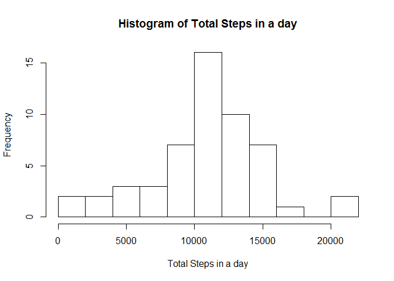
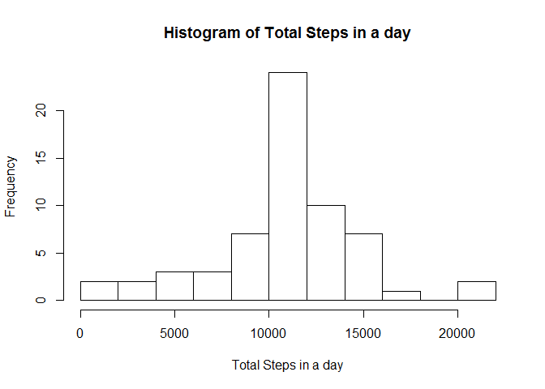

# Reproducible Research: Peer Assessment 1

### Activity Analysis Project
Load necessary libraries

```r
library(ggplot2)
library(lattice)
library(dplyr)
```

```
## 
## Attaching package: 'dplyr'
## 
## The following object is masked from 'package:stats':
## 
##     filter
## 
## The following objects are masked from 'package:base':
## 
##     intersect, setdiff, setequal, union
```


## Loading and preprocessing the data
1. Load the activities data file

```r
setwd("~/Rajesh/Courses/Data Science Specialization/5. Reproducible Research/proj1/repo")
activity <- read.csv("activity.csv", sep=",", header=T)
str(activity)
```

```
## 'data.frame':	17568 obs. of  3 variables:
##  $ steps   : int  NA NA NA NA NA NA NA NA NA NA ...
##  $ date    : Factor w/ 61 levels "2012-10-01","2012-10-02",..: 1 1 1 1 1 1 1 1 1 1 ...
##  $ interval: int  0 5 10 15 20 25 30 35 40 45 ...
```

2. Remove rows containing NA values

```r
data <- na.omit(activity)
str(data)
```

```
## 'data.frame':	15264 obs. of  3 variables:
##  $ steps   : int  0 0 0 0 0 0 0 0 0 0 ...
##  $ date    : Factor w/ 61 levels "2012-10-01","2012-10-02",..: 2 2 2 2 2 2 2 2 2 2 ...
##  $ interval: int  0 5 10 15 20 25 30 35 40 45 ...
##  - attr(*, "na.action")=Class 'omit'  Named int [1:2304] 1 2 3 4 5 6 7 8 9 10 ...
##   .. ..- attr(*, "names")= chr [1:2304] "1" "2" "3" "4" ...
```

## What is mean total number of steps taken per day?

1. Calculate the total number of steps taken per day

```r
grouped_data <- group_by(data, date )
result1 <- summarise(grouped_data, sum(steps))
names(result1) <- c("Date", "TotalSteps")
str(result1)
```

```
## Classes 'tbl_df', 'tbl' and 'data.frame':	53 obs. of  2 variables:
##  $ Date      : Factor w/ 61 levels "2012-10-01","2012-10-02",..: 2 3 4 5 6 7 9 10 11 12 ...
##  $ TotalSteps: int  126 11352 12116 13294 15420 11015 12811 9900 10304 17382 ...
##  - attr(*, "drop")= logi TRUE
```

2. histogram of the total number of steps taken each day

```r
hist(result1$TotalSteps, breaks=10, xlab="Total Steps in a day", main="Histogram of Total Steps in a day")
```

 


3. Calculate and report the mean and median of the total number of steps taken per day

```r
summary(result1$TotalSteps)
```

```
##    Min. 1st Qu.  Median    Mean 3rd Qu.    Max. 
##      41    8841   10760   10770   13290   21190
```


## What is the average daily activity pattern?
1. Make a time series plot (i.e. type = "l") of the 5-minute interval (x-axis) and the average number of steps taken, averaged across all days (y-axis)


```r
group2 <- group_by(data, interval)
result2 <- summarise(group2, mean(steps))
result2
```

```
## Source: local data frame [288 x 2]
## 
##    interval mean(steps)
## 1         0   1.7169811
## 2         5   0.3396226
## 3        10   0.1320755
## 4        15   0.1509434
## 5        20   0.0754717
## 6        25   2.0943396
## 7        30   0.5283019
## 8        35   0.8679245
## 9        40   0.0000000
## 10       45   1.4716981
## ..      ...         ...
```

```r
names(result2) <- c("interval", "MeanSteps")
plot(result2$interval, result2$MeanSteps, type="l", xlab="5-min interval", ylab="Avg. Number of Steps") 
abline(v=result2$interval[which.max(result2$MeanSteps)], untf=FALSE, lwd=3, col="red")
text(900,200,"835")
```

 


2. Which 5-minute interval, on average across all the days in the dataset, contains the maximum number of steps?

```r
idx <- which.max(result2$MeanSteps)
result2$interval[idx]
```

```
## [1] 835
```


## Inputing missing values

1. Calculate and report the total number of missing values in the dataset (i.e. the total number of rows with NAs)

```r
sum(!complete.cases(activity)) 
```

```
## [1] 2304
```

2. Devise a strategy for filling in all of the missing values in the dataset. The strategy does not need to be sophisticated. For example, you could use the mean/median for that day, or the mean for that 5-minute interval, etc.

```r
## Strategy is to use the mean of the interval as a value for missing data
```

3. Create a new dataset that is equal to the original dataset but with the missing data filled in.

```r
for (i in 1:nrow(activity)) {
  if (is.na(activity$steps[i])) {
    intvl <- activity$interval[i];
    activity$steps[i] <- round(result2$MeanSteps[which(result2$interval==intvl, arr.in=TRUE)])
  }
}
```

4. Make a histogram of the total number of steps taken each day and Calculate and report the mean and median total number of steps taken per day. Do these values differ from the estimates from the first part of the assignment? What is the impact of imputing missing data on the estimates of the total daily number of steps?

```r
grouped_data <- group_by(activity, date )
result3 <- summarise(grouped_data, sum(steps))
names(result3) <- c("Date", "TotalSteps")
str(result3)
```

```
## Classes 'tbl_df', 'tbl' and 'data.frame':	61 obs. of  2 variables:
##  $ Date      : Factor w/ 61 levels "2012-10-01","2012-10-02",..: 1 2 3 4 5 6 7 8 9 10 ...
##  $ TotalSteps: num  10762 126 11352 12116 13294 ...
##  - attr(*, "drop")= logi TRUE
```
Histogram - Not much change, except number of days with mean number of steps have increased

```r
hist(result3$TotalSteps, breaks=10, xlab="Total Steps in a day", main="Histogram of Total Steps in a day")
```

 

No Change in Mean and Median, since mean was used to fill the NA's

```r
summary(result1$TotalSteps)
```

```
##    Min. 1st Qu.  Median    Mean 3rd Qu.    Max. 
##      41    8841   10760   10770   13290   21190
```

## Are there differences in activity patterns between weekdays and weekends?

1. Create a new factor variable in the dataset with two levels - "weekday" and "weekend" indicating whether a given date is a weekday or weekend day.

```r
library(timeDate)
```

```
## Warning: package 'timeDate' was built under R version 3.1.3
```

```r
nr <- nrow(activity)
day <- vector(, nr)
activity <- cbind(activity, day)
activity$day <- isWeekday(as.Date(activity$date))
activity$day <- factor(activity$day , labels=c("weekend", "weekday"))
str(activity)
```

```
## 'data.frame':	17568 obs. of  4 variables:
##  $ steps   : num  2 0 0 0 0 2 1 1 0 1 ...
##  $ date    : Factor w/ 61 levels "2012-10-01","2012-10-02",..: 1 1 1 1 1 1 1 1 1 1 ...
##  $ interval: int  0 5 10 15 20 25 30 35 40 45 ...
##  $ day     : Factor w/ 2 levels "weekend","weekday": 2 2 2 2 2 2 2 2 2 2 ...
```

2. Make a panel plot containing a time series plot (i.e. type = "l") of the 5-minute interval (x-axis) and the average number of steps taken, averaged across all weekday days or weekend days (y-axis). See the README file in the GitHub repository to see an example of what this plot should look like using simulated data.

```r
wk_day_grp <- group_by(activity, interval, day)
wk_day_result <- summarise(wk_day_grp, mean(steps))
names(wk_day_result)
```

```
## [1] "interval"    "day"         "mean(steps)"
```

```r
names(wk_day_result) <- c("interval", "day", "MeanSteps")
wk_day_result
```

```
## Source: local data frame [576 x 3]
## Groups: interval
## 
##    interval     day  MeanSteps
## 1         0 weekend 0.25000000
## 2         0 weekday 2.28888889
## 3         5 weekend 0.00000000
## 4         5 weekday 0.40000000
## 5        10 weekend 0.00000000
## 6        10 weekday 0.15555556
## 7        15 weekend 0.00000000
## 8        15 weekday 0.17777778
## 9        20 weekend 0.00000000
## 10       20 weekday 0.08888889
## ..      ...     ...        ...
```

```r
xyplot( MeanSteps ~ interval | day, data = wk_day_result, layout = c(1, 2), type="l", ylab="Number of Steps")
```

 
